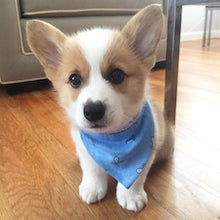

# Carmen Li

## About Me
*Hello!* My name is **Carmen** and I'm currently a second-year **Computer Science** major at UCSD. I have strong interests in the intersection between art, technology, and humanities, and I aspire to create for social good. Outside of work, I enjoy baking, drawing, and binge-watching [k-dramas](kdramas.md). 

I'm a huge animal lover so here are some pictures of my favorite animals!

I also would love to travel around the world so here's a list of places I've been and want to go.
- [x] New York
- [x] Hawaii
- [x] Seattle
- [x] Hong Kong
- [ ] Taiwan
- [ ] Japan
- [ ] South Korea
- [ ] Greece

## Experience
- CSE Tutor
> Currently tutoring for Paul Cao's CSE 8A (Introduction to Computer Science) in `python`. Responsibilities include writing up assignments and test scripts, grading, holding tutor hours, and answering discussion posts. Previously tutored for Paul Cao's CSE 11 in `java`.

- CSE Design Lab
> I was a student researcher for the automation design team in Fall 2020. I analyzed secondary research and conducted literature reviews to examine the levels of automated vehicles on the behalf of Ford.

## Projects 
- Platter
> Worked as a front-end/mobile engineer in a team of 10 to create a mobile marketplace for local chefs.

- Whalebeing
> Coordinated front-end development of a quiz-based web app advocating for raising mental health.

## Contact
1. [Linkedin](linkedin.com/in/carmen-li/)
2. <cal009@ucsd.edu>